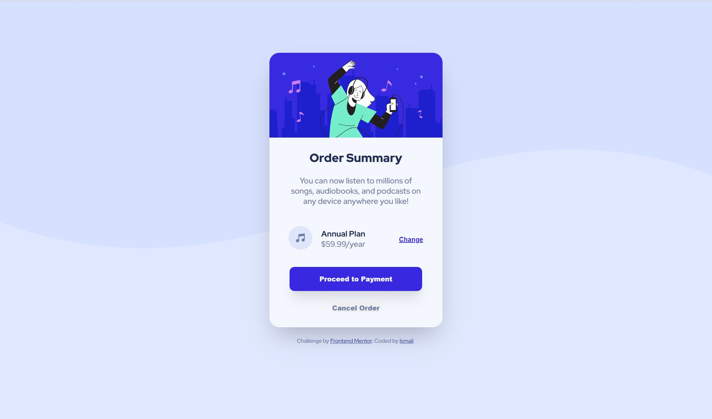

# Frontend Mentor - Order summary card solution

This is a solution to the [Order summary card challenge on Frontend Mentor](https://www.frontendmentor.io/challenges/order-summary-component-QlPmajDUj). Frontend Mentor challenges help you improve your coding skills by building realistic projects.

## Table of contents

- [Overview](#overview)
  - [The challenge](#the-challenge)
  - [Screenshot](#screenshot)
  - [Links](#links)
- [My process](#my-process)
  - [Built with](#built-with)
  - [What I learned](#what-i-learned)
- [Author](#author)

## Overview

To create an order summary card component as close to the design files provided.

### The challenge

Users should be able to:

- View the optimal layout depending on their device's screen size
- See hover states for interactive elements

### Screenshot



### Links

- Solution URL: [here](https://github.com/Ishi1834/order-summary-component)
- Live Site URL: [here](https://ishi1834.github.io/order-summary-component/)

### Built with

- Semantic HTML5 markup
- CSS custom properties
- Flexbox
- Mobile-first workflow

### What I learned

How to use an svg background:

```html
<body>
  <div class="background-image"></div>
</body>
```

```css
.background-image {
  background: url("images/pattern-background-mobile.svg") no-repeat center/cover;
  height: 400px;
  position: absolute;
  top: 0;
  left: 0;
  right: 0;
  bottom: 0;
  z-index: -1;
}
```

## Author

- Github - [@Ishi1834](https://github.com/Ishi1834)
- Frontend Mentor - [@Ishi1834](https://www.frontendmentor.io/profile/Ishi1834)
- CodePen - [@sadiq1834](https://codepen.io/sadiq1834)
